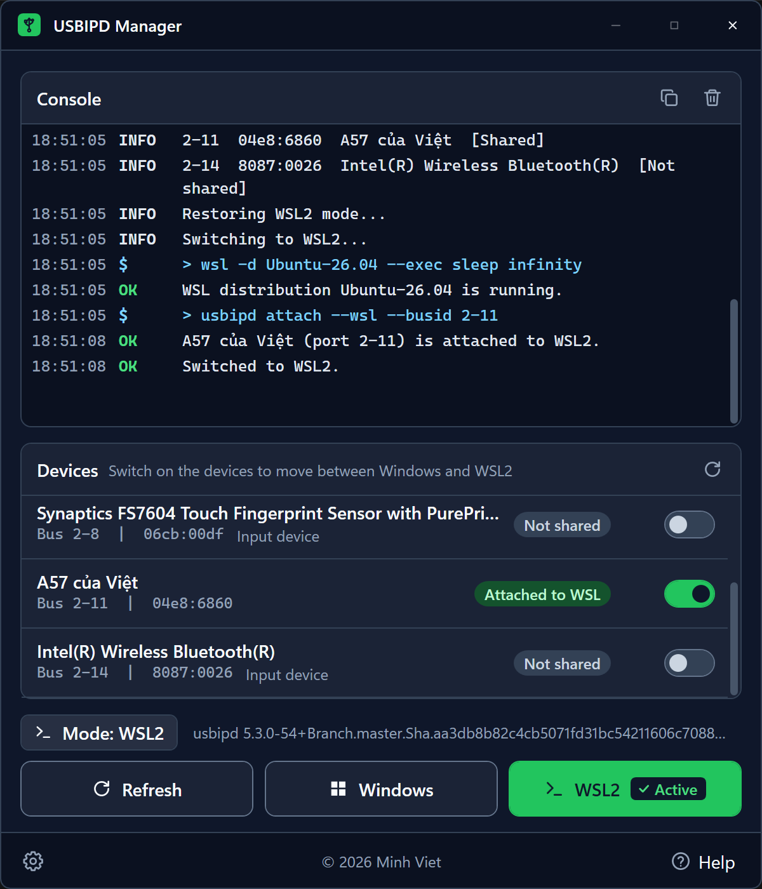
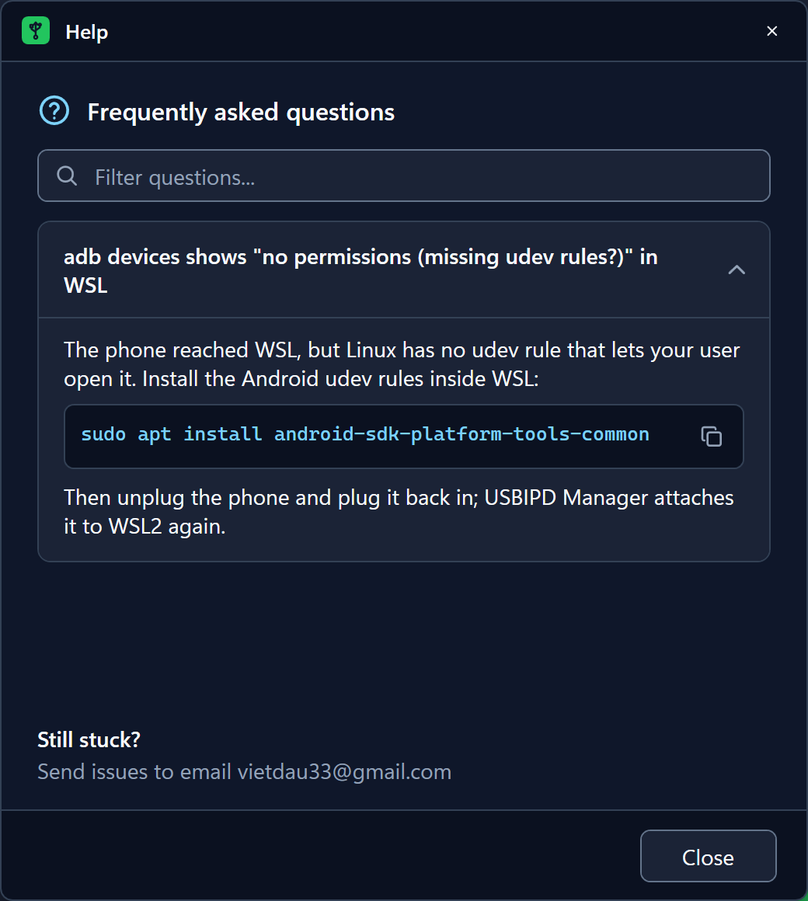
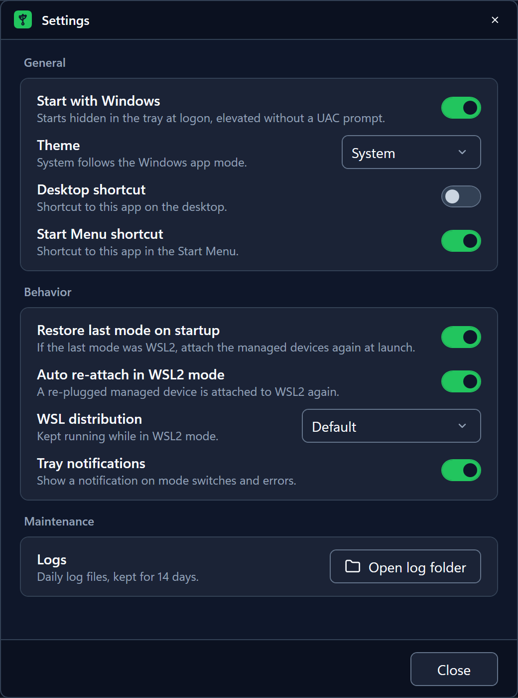
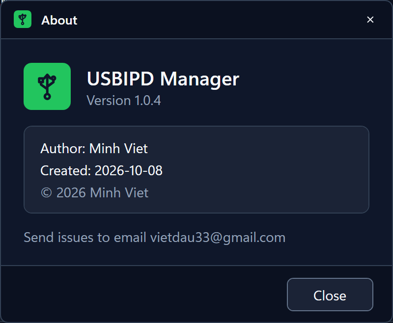

# USBIPD Manager

A Windows tray app that moves USB devices between **Windows** and **WSL2** with one click, built on [usbipd-win](https://github.com/dorssel/usbipd-win).
Made for debugging Flutter/Android apps inside WSL2 on a real phone while keeping the phone usable from Windows.

<p align="center"></p>

## Features

- Lives in the system tray and starts with Windows **elevated, without a UAC prompt** (Task Scheduler logon task).
- **Init** checks and fixes the environment: installs usbipd-win with winget, starts its service, shares the selected devices.
- **Windows** / **WSL2** buttons move the devices you switched on; the choice is remembered.
- Per-device switches remembered by **port + device identity**: plug the same phone into the same port and it follows the mode again automatically; another device on that port is left alone.
- Auto re-attach after a re-plug in WSL2 mode. Exit returns everything to Windows and restores the mode at next start.
- Console log of every check and command, light/dark/system theme, desktop and Start Menu shortcut switches.

## Requirements

- Windows 10/11 x64 with **WSL 2** and at least one WSL 2 distribution (the app reports the machine as unsupported otherwise).
- Administrator rights.
- usbipd-win is installed by the app (Init) if missing.

## Install

Download from [Releases](https://github.com/vietdm/usbipd-win-manager/releases/latest):

- **Installer**: `UsbipdManager-Setup-<version>.exe`, keep "Start with Windows" ticked.
- **Portable**: `UsbipdManager-<version>-portable.exe`, run it from any folder; turn on "Start with Windows" in Settings.

### Trust the signing certificate first (required)

The release binaries are signed with a **self-signed** certificate (`CN=Minh Viet`), not one from a public certificate authority. Windows does not know it, so trust it once per machine **before** running the app:

1. From the same release, download `USBIPD-Manager-CodeSigning.cer` and `install-certificate.bat` into the **same folder**.
2. Check that it is the right certificate: in that folder run `certutil -dump USBIPD-Manager-CodeSigning.cer` and compare the hashes:
   - `Cert Hash(sha1)`: `27849ed8178e300c4ad83cf1b9ccff5d446fb465`
   - `Cert Hash(sha256)`: `d820d0d5dcecd4048ba34b2bfff6a24add39ae6eef2a5b4355341c50bc3caf25`
3. Double-click `install-certificate.bat` and accept the administrator prompt. It adds the certificate to **Local Computer > Trusted Root Certification Authorities**.
   Without the script: from an administrator terminal, run `certutil -addstore -f Root USBIPD-Manager-CodeSigning.cer`.
4. Run the installer or the portable exe. The UAC prompt now shows **Verified publisher: Minh Viet**; Properties > Digital Signatures of the exe shows "This digital signature is OK".

Good to know:

- Without the certificate the app still runs, but UAC shows "Unknown publisher" for every launch you start yourself.
- **Smart App Control must be Off** (Windows Security > App & browser control). It only accepts certificates from Microsoft-trusted authorities, so it blocks the app even after the certificate is trusted.
- Files downloaded from the internet can trigger SmartScreen ("Windows protected your PC") the first time; choose **More info > Run anyway**, or clear **Unblock** in the file's Properties.
- The certificate is limited to code signing and cannot act as a certificate authority (`ca=0`), so trusting it does not let it vouch for websites or other certificates. To remove it later: `certutil -delstore Root 27849ed8178e300c4ad83cf1b9ccff5d446fb465` (as administrator).
- If you build the app yourself, `setup.bat` or `tools\signing\New-CodeSigningCert.ps1` creates and trusts your own certificate instead (see Development).

## Usage

1. Double-click the tray icon to open the window.
2. Press **Init** once (it turns into **Refresh** when everything is ready).
3. Turn on the switch of your phone in the device list.
4. Press **WSL2** to give it to WSL (`adb devices` inside WSL now sees it) or **Windows** to give it back.

Right-click the tray icon for Open, Switch to Windows, Switch to WSL2, About and Exit. **Help** in the window footer answers common problems (for example adb "no permissions" in WSL). Issues: vietdau33@gmail.com.

| Help | Settings | About |
| :---: | :---: | :---: |
|  |  |  |

## Development

Requirements: .NET SDK 10, Inno Setup 6 (only for the installer), Windows PowerShell 5.1+, Windows SDK signtool (optional, for signing).

**Easiest on a new machine: double-click `setup.bat`.** It asks for administrator rights, checks .NET SDK 10, Inno Setup 6, the Windows SDK signtool and the code signing certificate, installs what is missing with winget after a `[Y/n]` confirmation (Enter = yes), creates and trusts the certificate, closes a running USBIPD Manager (devices go back to Windows), then builds the portable exe and the installer. `setup.bat --yes` answers yes to everything; other arguments go to `build.ps1` (for example `setup.bat --no-bump`).

Builds are signed by default. Manual one-time setup instead of `setup.bat`, from an administrator PowerShell:

```powershell
powershell -ExecutionPolicy Bypass -File tools\signing\New-CodeSigningCert.ps1                       # create + trust the certificate
powershell -ExecutionPolicy Bypass -File tools\signing\New-CodeSigningCert.ps1 -PfxPath D:\backup.pfx  # same, plus a private-key backup
```

```powershell
dotnet build UsbipdManager.slnx
dotnet test UsbipdManager.slnx

.\build.ps1 --dry-run                     # show what would happen
.\build.ps1                               # bump PATCH (1.0.3 -> 1.0.4), build dist\UsbipdManager-<v>-portable.exe
.\build.ps1 --version 2                   # 2.0.0 (must be greater than the current version); 2.2 -> 2.2.0; 2.2.5 allowed
.\build.ps1 --no-bump                     # rebuild the current version
.\build.ps1 -i                            # also build dist\UsbipdManager-Setup-<v>.exe
.\build.ps1 --release                     # first release sets the created date, later releases the updated date
.\build.ps1 --no-sign                     # skip signing (no certificate needed)
build.bat --version 1.1 --release -i      # same flags, double-click friendly
```

The version lives in `version.json` and is only written after a successful build. A successful build also removes the older builds it replaces from `dist` (older portable exe files; with `-i` older setup files too).

Project documentation for developers and AI agents: [CLAUDE.md](CLAUDE.md), [docs/ai-memory/](docs/ai-memory/), [docs/PLAN.md](docs/PLAN.md).

## License

© 2026 Minh Viet. Licensed under the [PolyForm Noncommercial License 1.0.0](LICENSE): free for personal and other noncommercial use; commercial use is not permitted.

usbipd-win, which the app installs and calls, is a separate project with its own license (GPL-3.0).
